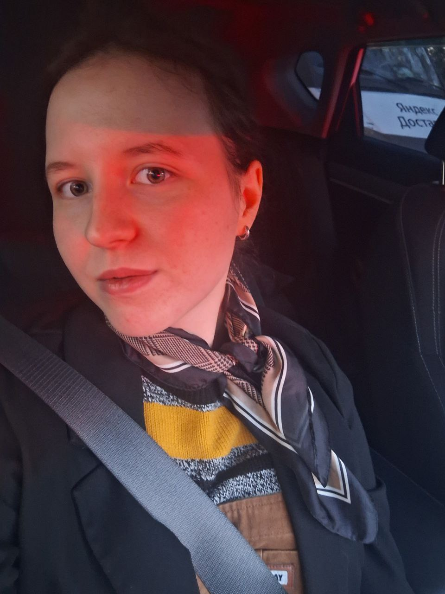

# Юлия Свободина
Frontend Developer

## Контакты ##
* __Локация:__ Москва, Россия
* __Телефон:__ [ +7 982 414 46 63 ](tel:+79824144663)
* __Email:__ july.svoboda@gmail.com
* __GitHub:__ [Jul-svoboda](https://github.com/Jul-svoboda)
* __Telegram:__ [Jul S](https://t.me/vVoXxx)

## О себе ##
Frontend-разработчик с техническим бэкграундом в области систем управления и практическим опытом работы с JavaScript и React. Ранее работала в научно-исследовательском институте, где занималась разработкой нейросетевых решений на Python.  

Перешла в веб-разработку, выполняла фриланс-проекты и сотрудничала с более опытными разработчиками. Имею опыт создания адаптивных интерфейсов, разработки переиспользуемых UI-компонентов и интеграции с REST API.

## Навыки ##
* HTML5, CSS3 (Flexbox, Grid, адаптивная верстка)
* JavaScript (ES6+, работа с DOM)
* Git, GitHub
* React
* Работа с REST API (fetch/axios)
* Figma
* Linux (базовый уровень)

## Опыт ##
**Frontend-разработчик (фриланс)**  

2022 – настоящее время  

Разработка адаптивных лендингов на HTML, CSS и JavaScript  
Разработка и поддержка UI-компонентов в сотрудничестве с более опытными разработчиками (субподряд)  
Участие в e-commerce проекте [ECCO](https://www.ecco.ru/about/career/) (адаптивная верстка и разработка отдельных компонентов)  
Работа с макетами в Figma, обеспечение кроссбраузерности  
Выполнение коммерческих задач в рамках требований заказчика и сроков  

**Государственный научно-исследовательский институт авиационных систем**  

Техник

Разработка решений на основе нейронных сетей на Python  
Работа с системами компьютерного зрения (включая задачи распознавания в реальном времени)  
Опыт работы в инженерной команде и участие в исследовательских проектах  

## Проекты ##

### Лендинг для фотографа ###

Стек: HTML, CSS, JavaScript  

Адаптивный лендинг, реализованный с нуля (верстка, стилизация, интерактивность).  

[Live](https://photographers-portfolio228.netlify.app/) | [GitHub](https://github.com/Jul-svoboda/Portfolio-photographer.git)

---

### Интернет-магазин (Full-stack проект, в разработке) ###

Стек: React, Node.js, Express, PostgreSQL, Sequelize, JWT, REST API, HTML, CSS  

Full-stack приложение интернет-магазина с React-клиентом и собственной backend-частью.  

__Backend:__

- REST API с CRUD-операциями для товаров, брендов и категорий  
- Аутентификация и авторизация на основе JWT  
- Ролевая модель доступа  
- Фильтрация и сортировка товаров  
- Централизованная обработка ошибок  
- Загрузка и хранение изображений  
- Работа с PostgreSQL через Sequelize ORM  

__Frontend:__

* Каталог товаров с фильтрацией  
* Корзина  
* Переиспользуемые UI-компоненты  
* Интеграция с backend API  

Статус: в разработке  

_Frontend:_  
[Live](https://online-store-api-frontend.onrender.com/) | [GitHub](https://github.com/Jul-svoboda/online-store-api-frontend.git)  

_Backend:_  
[Live](https://online-store-api-n0ix.onrender.com) | [GitHub](https://github.com/Jul-svoboda/online-store-api.git)

---

### React User List App ###

Стек: React, JavaScript, API  

Приложение с формой и интеграцией REST API с удалённого сервера.  

Функциональность: получение данных, динамический рендеринг, базовое управление состоянием  

[Live](https://list-of-users335.netlify.app/) | [GitHub](https://github.com/Jul-svoboda/user-list.git)

## Образование ##
* Московский авиационный институт, системы управления  
* Курсы:
    * [Stepik JS](https://stepik.org/210361)
    * [Школа 21 (интенсив)](https://21-school.ru/)
    * [Rolling Scopes School — JavaScript и Frontend](https://rs.school/)

## Языки ##
* Русский — родной  
* Английский — A2 (базовый уровень, чтение документации)
